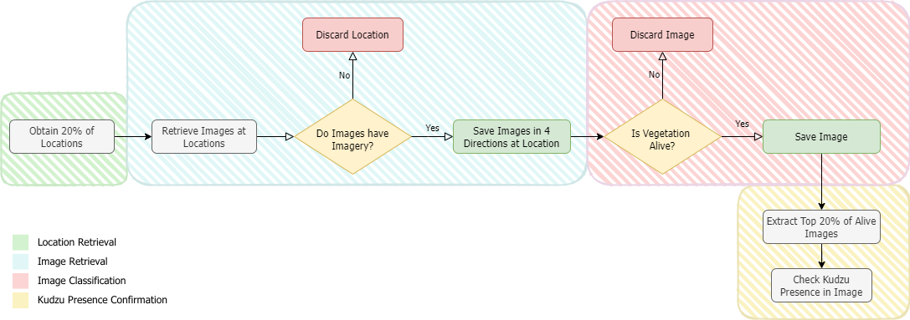

# Concurrent Geospatial Data for Supervising Invasive Species in Small and Dispersed Areas 

## ONE LINER OF WHAT IT DOES

Intro paragraph use keywords here.

## Visual Helper: diagram video

## Datasets
- Locations: [USGS Inhabit database](https://gis.usgs.gov/inhabit/)

- Training Dataset: [Kudzu Alive vs Dead](https://www.kaggle.com/datasets/albaclosatarres/alive-vs-dead-kudzu-vegetation) 

## Requirements

For CPU or GPU:
- Tensorflow version older than 2.11: `!pip install "tensorflow<2.11"`
- 

Only for GPU:
- Cuda and Cudnn: `conda install -c conda-forge cudatoolkit=11.2 cudnn=8.1.0 -y`

GPU set-up help for Windows 11 ([tutorial](https://www.xda-developers.com/use-gpu-jupyter-notebook/)) 
Tensorflow MacOS Anaconda ([tutorial](https://www.youtube.com/watch?v=CrEl8QL8hsM))
If need it: !pip list

## How to use this workflow
User Instructions for general users no need to be coders
1. Clone this repository
2. Create a virtual environmnent
3. Download Training Dataset [Kudzu Alive vs Dead](https://www.kaggle.com/datasets/albaclosatarres/alive-vs-dead-kudzu-vegetation) and save the files inside the data 
4. Save 
5. Obtain a Google Maps API key
6. Run 1.MATLABCODE.ipynb. 
7. Run 2.StreetView.ipynb, make sure to edit the variable `api_key = <YOUR_API_KEY_GOES_HERE>`
8. Run 3.DeepCNNImageClassifier.ipynb, make sure to edit the path variables `your_directory = <YOUR_FOLDER_GOES_HERE>`
9. Run 4.Image Confirmation.ipynb, 
10. qwert

For more detailed steps: Step by Step [Project.Docs](https://www.kaggle.com/datasets/albaclosatarres/alive-vs-dead-kudzu-vegetation) 

## How to tweak this project for your own purposes
Use other plants

Requirements:
step 1: Image retriveation
`python -m pip install requests`

### Known Issues

### Contact
Email: aclosatarres@wvstateu.edu

**Keywords:** geographic information systems, google street view, ecology, kudzu, workflow,
image classification, object detection, convolutional neural networks
