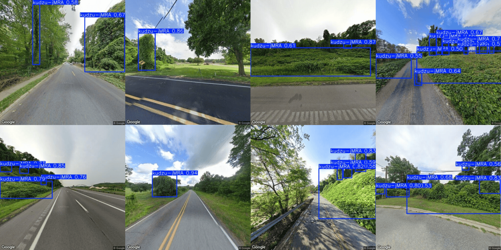
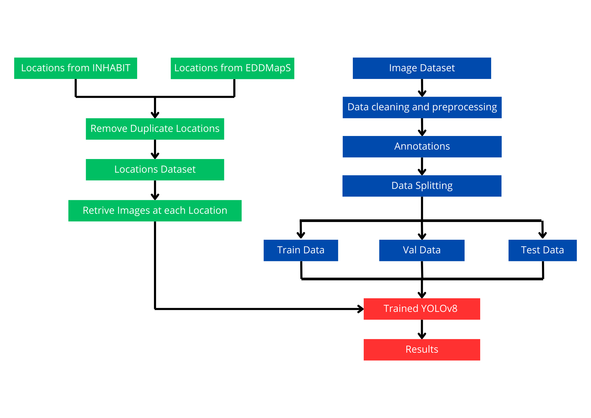

# Concurrent Geospatial Data for Supervising Invasive Species in Small and Dispersed Areas 
A geospatial data-driven approach to efficiently identify and manage invasive kudzu plant habitats using object detection techniques.



## Overall Description
This project integrates geographic information systems to preprocess and integrate geospatial datasets, efficiently defining areas of interest (AOI) for kudzu habitats. The workflow utilizes Google Street View images and advanced techniques such as image classification and object detection, leveraging convolutional neural networks to confirm kudzu presence. This approach combines agriculture and technology to identify and manage invasive species habitats. By streamlining these processes, we reduce the need for extensive field trips and computational time, enhancing invasive species monitoring and management.


## Workflow


## Datasets
- Locations: [USGS Inhabit database](https://gis.usgs.gov/inhabit/)
- Training Dataset: [Kudzu Dataset](https://app.roboflow.com/test-mhm3s/kudzu-in-gsv/3) 

## Main Requirements
The main requirements are:
```python
numpy               1.24.4<=2.1.1,>=1.23.0
matplotlib          3.7.5>=3.3.0
opencv-python       4.11.0.86>=4.6.0
pillow              10.4.0>=7.1.2
pyyaml              6.0.2>=5.3.1
requests            2.32.3>=2.23.0
scipy               1.10.1>=1.4.1
torch               2.4.1>=1.8.0
torch               2.4.1!=2.4.0,>=1.8.0; sys_platform == "win32"
torchvision         0.19.1>=0.9.0
tqdm                4.67.1>=4.64.0
psutil              6.1.1
py-cpuinfo          9.0.0
pandas              2.0.3>=1.1.4
seaborn             0.13.2>=0.11.0
ultralytics-thop    2.0.14>=2.0.0
```
All libraries and specific versions in [requirements.txt](requirements.txt).

## How to use this workflow
Steps:
1. Create a virtual environment with all the requirements.
2. Obtain a Google Maps API Key & a Roboflow API Key.
3. Run 1.StreetView.ipynb: this is the GSV Image Retrieval process. Make sure to edit the variables `api_key = <YOUR_API_KEY_GOES_HERE>` and `your_directory = "YOUR_BASE_DIRECTORY_GOES_HERE"`.
4. Run 2.YOLO.ipynb: this is the Kudzu Detection process. Make sure to edit the variable `api_key = <YOUR_API_KEY_GOES_HERE`

### Contact
Email: aclosatarres@wvstateu.edu

**Keywords:** geographic information systems, Google Street View (GSV), ecology, kudzu, workflow, object detection, convolutional neural networks
