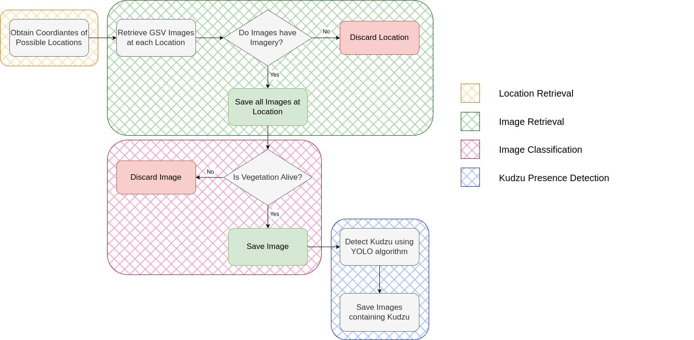

# Concurrent Geospatial Data for Supervising Invasive Species in Small and Dispersed Areas 

### A geospatial data-driven approach to efficiently identify and manage invasive kudzu plant habitats using image recognition and classification techniques.

This project integrates geographic information systems to preprocess and integrate geospatial datasets, efficiently defining areas of interest (AOI) for kudzu habitats. The workflow utilizes Google Street View images and advanced techniques such as image classification and object detection, leveraging convolutional neural networks to confirm kudzu presence. This approach combines agriculture and technology to identify and manage invasive species habitats. By streamlining these processes, we reduce the need for extensive field trips and computational time, enhancing invasive species monitoring and management.

## Workflow

## Datasets
- Locations: [USGS Inhabit database](https://gis.usgs.gov/inhabit/)

- Training Dataset: [Kudzu Alive vs Dead](https://www.kaggle.com/datasets/albaclosatarres/alive-vs-dead-kudzu-vegetation) 

## Requirements
Only for GPU:
- Cuda and Cudnn: `cudatoolkit=11.2 cudnn=8.1.0 `

Libraries needed for each file:
- requirements.txt

## Help Setting Up the requirements
Windows:
- Use `pip` to install libraries
- GPU set-up for Windows 11 ([tutorial](https://www.xda-developers.com/use-gpu-jupyter-notebook/))  
MacOS:
- Use `conda` to install libraries

## How to use this workflow
User Instructions for general users no need to be coders
1. Clone this repository
2. Create a virtual environmnent
3. Download Training Dataset [Kudzu Alive vs Dead](https://www.kaggle.com/datasets/albaclosatarres/alive-vs-dead-kudzu-vegetation) and save the files inside the data directory
4. Obtain a Google Maps API key
5. Run 1.StreetView.ipynb, image retrival part. Make sure to edit the variable `api_key = <YOUR_API_KEY_GOES_HERE>`
6. Run 2.DeepCNNImageClassifier.ipynb, make sure to edit the path variables `your_directory = <YOUR_FOLDER_GOES_HERE>`
7. Run 3.Image Confirmation.ipynb, 

For more detailed steps: Step by Step [Project.Docs](https://www.kaggle.com/datasets/albaclosatarres/alive-vs-dead-kudzu-vegetation) 

### Known Issues

### Contact
Email: aclosatarres@wvstateu.edu

**Keywords:** geographic information systems, google street view, ecology, kudzu, workflow,
image classification, object detection, convolutional neural networks
